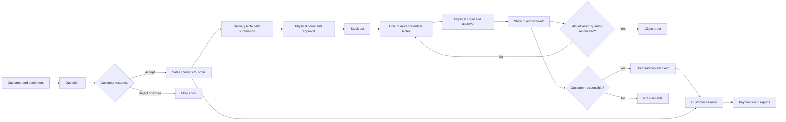
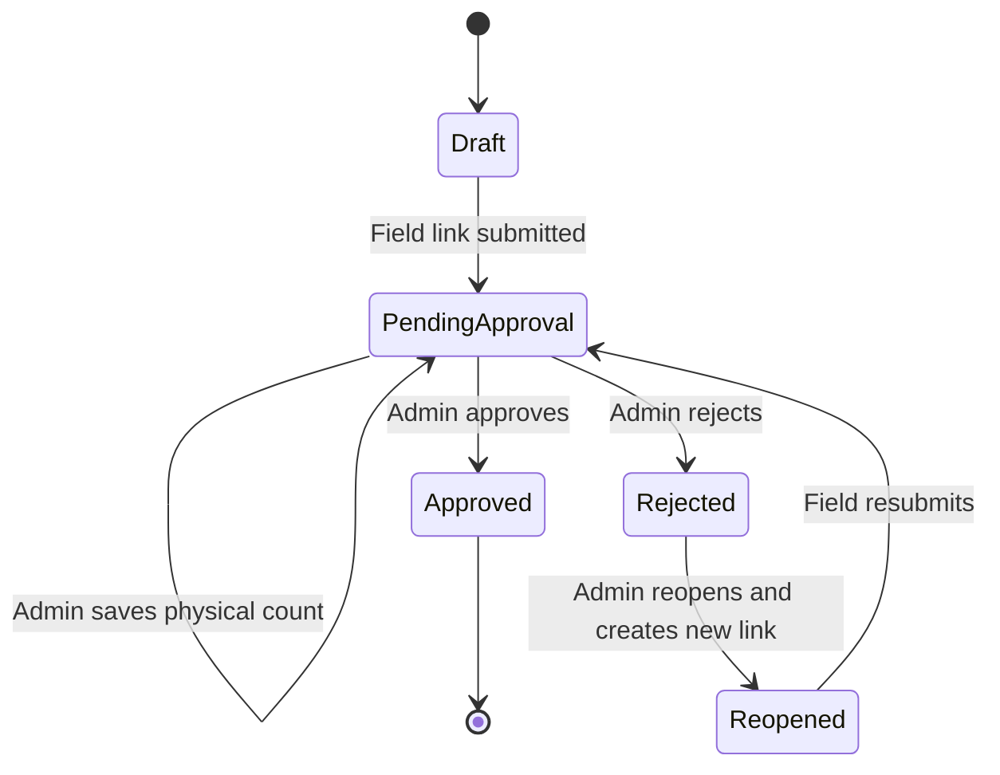

# HERMS Superuser Story and Complete End-to-End Test Guide

Date: 2026-09-12

Primary tester: Super User

Supporting testers: developer and intern/student pair

Environment: development or staging only

## 1. What the Super User can do

The `super_user` role can open and operate every protected HERMS feature area:

- Dashboard
- Customers & Pricing
- Equipment
- Quotations
- Orders & Notes
- Approvals
- Stock
- Discrepancies & Claims
- Payments & Finance
- Audit-log API access

The current application does **not** contain a user-management tab. A Super User account is provisioned with `bun run db:create-super-user`; this guide does not treat user creation or role editing as a browser feature.

WhatsApp delivery is manual. HERMS prepares a link or message and opens WhatsApp Web, but the staff member selects the recipient and presses Send. A successful HERMS action must not be reported as an automatically delivered WhatsApp message.

## 2. The connected business story

Use one reference on every record created during a test run, for example `UAT-20260912-A`. This makes test records easy to find without deleting immutable business history.

The story follows Maya, the HERMS Super User, and Ocean Pearl Hotel:

1. Maya signs in and sees all nine navigation tabs.
2. She adds Ocean Pearl Hotel as a new customer.
3. She checks that Dinner Plate and Chafing Dish exist as equipment, have correct prices, and have reorder thresholds.
4. Ocean Pearl becomes a recurring customer, so Maya adds a negotiated Dinner Plate price. Items without an exception continue to use the equipment price.
5. Maya creates and shares a quotation. The customer opens the secure link without signing in and accepts it.
6. Maya converts the accepted quotation to exactly one order. The order keeps the prices that were present on the quotation.
7. Maya creates a Delivery Note and shares its secure field link. The field worker records what was actually handed over.
8. The submitted note appears in Approvals. Maya enters a physical count. Stock still does not move until she approves.
9. Approval posts stock-out movements and may open a reorder alert.
10. Equipment is returned over several visits through Retention Notes. Each submitted note is physically counted and approved before stock-in or write-off is posted.
11. The final return contains a customer-responsible loss and a staff-responsible loss. Only the customer-responsible loss may become a claim.
12. Finance drafts and confirms the customer claim. The balance changes only after confirmation.
13. Maya records partial payments and a business expense, then confirms that finance totals and graphs reconcile.
14. When all delivered quantities are returned or written off, Maya closes the order as Fully Returned.
15. The Dashboard, Stock, Claims, and Finance tabs now tell the same story with the same quantities and values.

The two approval gates are the heart of HERMS:

## 3. Standard test data

Create fresh data with a unique run reference. Suggested values:

- Run reference: `UAT-20260912-A`
- Customer: `Ocean Pearl Hotel - UAT-20260912-A`
- Email: `uat-ocean-pearl@example.test`
- Phone: `+94 77 000 0001`
- Address: `1 Test Road, Colombo`
- Equipment A: `Dinner Plate - UAT-20260912-A`
- Equipment A opening price: `8000` minor units, meaning LKR 80.00
- Equipment A reorder threshold: `25`
- Equipment B: `Chafing Dish - UAT-20260912-A`
- Equipment B opening price: `150000` minor units, meaning LKR 1,500.00
- Customer special price for Equipment A: LKR 75.00
- Standard quotation: 100 Dinner Plates and 10 Chafing Dishes
- Custom-price check: change only the selected Dinner Plate line to LKR 70.00
- Expense: `Transport - UAT-20260912-A`, `250000` minor units, meaning LKR 2,500.00

Be careful with money inputs:

- Equipment prices and expense amounts are entered in integer minor units.
- Customer special prices, quotation custom prices, and payments are entered in LKR with up to two decimal places.
- For LKR 1,500.50, enter `150050` in a minor-unit field but `1500.50` in an LKR field.

## 4. How the team should run each scenario

For every scenario:

1. The intern/student performs the written steps exactly and records actual results.
2. The Super User confirms business correctness, especially quantities, money, statuses, and graph meaning.
3. The developer watches the browser console, API logs, and network response when a scenario fails.
4. Capture the run reference, scenario ID, browser, viewport, timestamp, screenshots, request ID, and affected record number.
5. Mark `Pass` only when the visible result, persisted result after refresh, and downstream result are all correct.
6. Mark `Blocked` when required data or environment access is unavailable; do not call it a product failure.
7. Mark `Fail` for incorrect behavior, a 5xx response, wrong totals, missing audit attribution, or a security/permission breach.

Run destructive or history-producing scenarios only in development/staging. Stock ledger, audit log, payments, price history, and reversals are append-only by design; ordinary cleanup is not part of the product.

## 5. Login, session, and Super User access

### SU-AUTH-001 — Valid Super User login

- Open `/login`, enter the provisioned Super User email and password, and select **Sign in**.
- Expect a redirect to `/dashboard`.
- Expect the user name and `super user` role in the application shell.
- Refresh the page. Expect the session to remain valid.

### SU-AUTH-002 — All tabs are visible

- After login, inspect desktop navigation and then a 390 px mobile viewport.
- Expect all nine tabs listed in section 1, with no clipped or unreachable mobile tab.

### SU-AUTH-003 — Wrong password

- Enter the correct email and an incorrect password.
- Expect a safe authentication error, no session cookie granting access, and no disclosure of whether the email exists.

### SU-AUTH-004 — Required and malformed fields

- Submit with both fields empty, then with an invalid email format.
- Expect browser validation and no API mutation.

### SU-AUTH-005 — Show and hide password

- Enter a password and use the eye button twice.
- Expect characters to become visible and then hidden; the value must not change.

### SU-AUTH-006 — Protected-route redirect

- Sign out, then directly open `/dashboard`, `/stock`, and `/finance`.
- Expect redirection to `/login` and no protected data flash.

### SU-AUTH-007 — Sign out

- Select **Sign out**, then use the browser Back button.
- Expect `/login`; protected data must not reappear.

### SU-AUTH-008 — Unknown route

- Open `/this-page-does-not-exist`.
- Expect the HERMS “Page not found” screen and a working **Return to HERMS** link.

## 6. Customers & Pricing tab

### SU-CUS-001 — Empty/loading/error behavior

- Observe the tab during loading. If using a clean database, also observe the empty state.
- Expect clear loading text, a usable empty state, and a readable error if the API is deliberately unavailable.

### SU-CUS-002 — Create a new customer

- Select **New customer**, enter the standard test customer, and save.
- Expect the dialog to close and the customer to appear in the register as `new` with zero orders and a settled balance.
- Refresh and expect the record to remain.

### SU-CUS-003 — Customer validation

- Try an empty name and a malformed email.
- Expect validation and no duplicate/partial customer record.

### SU-CUS-004 — Edit customer details

- Open the customer, change phone/address, select **Save customer**, and refresh.
- Expect the new details to persist without changing balances or order history.

### SU-CUS-005 — Convert to recurring with an exception

- In **Customer special prices**, add Dinner Plate, enter `75.00`, and save.
- Expect customer type `recurring` and the exception to persist.
- Expect unselected Chafing Dish to continue using its standard equipment price.

### SU-CUS-006 — Duplicate and empty special-price checks

- Confirm an already selected item is disabled in the equipment selector.
- Remove all exception rows and try to save.
- Expect the UI to require at least one customer-specific price.

### SU-CUS-007 — Register columns and links

- Confirm reference, type, contact, order count, and outstanding balance.
- Open the customer link and the equipment link from the fixed-price list.
- Expect both detail screens to match the selected records.

### SU-CUS-008 — Price history panel

- After an equipment price change, return to Customers & Pricing.
- Expect old price, new price, effective date, and reason; no edit/delete control may exist.

## 7. Equipment tab

### SU-EQP-001 — Create equipment

- Create both standard test items with name, category, unit, opening price, purchase price, and threshold.
- Expect them in the Equipment list and Customers & Pricing fixed-price list.

### SU-EQP-002 — Equipment validation

- Try blank name/category/unit, negative price, fractional minor units, and negative threshold.
- Expect rejection with no partial item or price-history row.

### SU-EQP-003 — Edit non-price details

- Change name/category/unit/purchase price/threshold and save.
- Expect only those fields to change; price history must be unchanged.

### SU-EQP-004 — Negotiated price change

- Change Dinner Plate from LKR 80.00 to LKR 85.00 using `8500` minor units and reason `Negotiated`.
- Expect current price LKR 85.00 and one new immutable history entry showing the previous price.

### SU-EQP-005 — Correction price change

- Record a correction back to `8000`.
- Expect another history row, not an edit of the negotiated row.

### SU-EQP-006 — Global price increase preview and cancel

- In **Owner control**, enter the increase percent you want (for example `15`), note the previewed new prices, select **Increase prices by 15%**, then cancel the confirmation.
- Expect no prices or histories to change.

### SU-EQP-007 — Global price increase apply

- Enter the same percent and confirm the action once.
- Expect every current equipment price to increase by that percent using whole-minor-unit rounding and a permanent owner-escalation history row.
- Record screenshots before and after because this is intentionally irreversible.

### SU-EQP-008 — Historical price freeze

- Create a quotation before an equipment price change, change the current price, then reopen the quotation/order/invoice.
- Expect all historical documents to retain their original unit prices and totals.

## 8. Quotations tab and customer response

### SU-QUO-001 — Quotation overview metrics

- Confirm **Awaiting response**, **Accepted this month**, **Quoted value**, and six-month **Conversion rate** agree with the quotation list.
- Recheck after each status-changing scenario.

### SU-QUO-002 — Standard pricing with customer exception

- Create a standard quotation for the recurring customer with both test items.
- Expect Dinner Plate to use LKR 75.00 and Chafing Dish to use its current equipment price.
- Expect quantity × unit price to equal every line total and the sum of lines to equal the quotation total.

### SU-QUO-003 — Standard pricing fallback

- Create a standard quotation for a new customer without special prices.
- Expect every line to use the current equipment price automatically.

### SU-QUO-004 — Custom pricing

- Select custom pricing. Change only Dinner Plate to LKR 70.00.
- Expect custom price input for every selected line, standard prices shown as references, and frozen custom totals after creation.

### SU-QUO-005 — Line validation

- Try zero/negative/fractional quantity, a quantity above current stock, blank equipment, blank custom price, zero custom price, and the same equipment twice.
- Expect a "Not enough stock" notice when quantity is above stock, creation to be blocked, and no quotation/outbox history to be created.

### SU-QUO-006 — Add and remove lines

- Add several lines, remove one, and verify already selected equipment cannot be selected again.
- Expect the final quotation to contain exactly the visible lines.

### SU-QUO-007 — Share dialog

- Create a quotation.
- Expect a secure customer link and expiry time. Copy it and verify the copied URL exactly matches the field.
- Expect no claim that WhatsApp was sent automatically.

### SU-QUO-008 — Manual WhatsApp and PDF

- Open quotation detail, download PDF, and open WhatsApp Web.
- Expect a valid PDF beginning with the quotation number and a prepared message; the staff user must still choose a recipient and attach/send manually.

### SU-QUO-009 — Public link privacy

- Open the customer link in a private browser with no login.
- Expect only the quotation, customer-facing line information, expiry, and response actions—not internal dashboards, balances, stock, staff phone numbers, or audit data.

### SU-QUO-010 — Customer accepts

- Select **Accept quotation** once.
- Expect status `accepted`, a message that HERMS staff can convert it, and no order until the Super User performs conversion.

### SU-QUO-011 — Customer rejects

- On a separate sent quotation, select **Reject quotation**.
- Expect status `rejected`, link closure, no conversion action, and no order.

### SU-QUO-012 — Staff rejects

- On another sent quotation, use the staff-side **Reject quotation** action.
- Expect the same terminal status and unusable response link.

### SU-QUO-013 — Expired/revoked/used link behavior

- Test an expired link and a link closed by rejection.
- Expect a safe unavailable message and no status change.
- Reload an accepted link; expect accepted state, not a second acceptance.

### SU-QUO-014 — Convert accepted quotation

- From the accepted quotation, select **Convert to order**.
- Expect one order with identical customer, lines, quantities, unit prices, and total.

### SU-QUO-015 — Duplicate conversion protection

- Refresh the accepted quotation and attempt conversion again through UI or API tooling.
- Expect the existing order or a conflict; never a second order.

## 9. Orders & Notes tab

### SU-ORD-001 — Summary and status

- Check Active orders, Awaiting delivery, Notes in field, and open order value.
- Expect status to move through Awaiting delivery → Delivered → Partially returned → Closed as approvals occur.

### SU-ORD-002 — Order detail and frozen values

- Open the new order.
- Expect source customer, ordered lines, frozen unit prices, line totals, and order total to match its quotation.

### SU-ORD-003 — Create Delivery Note

- In **Create delivery note**, choose active field staff and allocate the available quantities.
- Expect only unallocated quantities to be available and the remaining calculation to be correct.

### SU-ORD-004 — Delivery over-allocation

- Try allocating more than the remaining quantity or creating a second active note for already allocated units.
- Expect UI prevention and server conflict protection.

### SU-ORD-005 — Delivery link actions

- After creation, open/copy/share the link and download the Delivery Note PDF.
- Expect the correct DN number, order, customer, items, and expiry.

### SU-ORD-006 — Regenerate Delivery Note link

- Regenerate/resend the link.
- Expect a new link and the previous link to fail safely.

### SU-ORD-007 — Field submits an exact delivery

- Open the link without login and submit handed-over quantities equal to issued quantities.
- Expect status `pending approval`, success confirmation, and unchanged stock.

### SU-ORD-008 — Field submits a delivery mismatch

- On a separate DN, make handed-over quantity less than issued.
- Expect a required reason: Missing, Damaged, Not accepted, or Other.
- Choose Other without remarks; expect rejection. Add remarks and expect submission.

### SU-ORD-009 — Field correction window

- Resubmit the same pending note before an admin saves a count.
- Expect correction to succeed and update the discrepancy.
- After count begins, expect the field link/correction to be rejected.

## 10. Approvals tab and Stock tab

### SU-APR-001 — Queue and metrics

- After field submission, open Approvals.
- Expect the note in the store queue and correct Pending approval, Approved today, and Discrepancies flagged totals.

### SU-APR-002 — Approval without count

- Before saving a physical count, attempt approval using API tooling or the detail page state.
- Expect a conflict; stock and status must remain unchanged.

### SU-APR-003 — Count every line

- Enter physical count for each line and save.
- Expect missing lines to prevent completion and differences to be visibly flagged.

### SU-APR-004 — Count differs from field submission

- Enter one count different from the submitted amount.
- Expect a difference indicator before approval. Confirm the Super User consciously reviews it.

### SU-APR-005 — Approve Delivery Note

- Record the Stock tab values, approve the counted DN, and refresh Stock.
- Expect status `approved`, one append-only stock-out movement per positive counted line, updated in-store/on-rent values, and a source link back to the note.

### SU-APR-006 — Reject and reopen

- Reject a separate pending note.
- Expect its field link revoked and status `rejected`.
- Reopen it. Expect status `reopened`, cleared counts, and a new shareable link.

### SU-APR-007 — Failed stock posting retry

- In a controlled developer test, make the stock-post transaction fail.
- Expect the note to remain pending and no partial ledger/audit/outbox data.
- Restore the dependency and approve again; expect one complete posting.

### SU-STK-001 — Stock metric reconciliation

- For each test item, calculate the signed sum of movements.
- Expect **In store** to equal that sum, **On rent** to reflect approved delivered less returned/written-off quantities, and Stock value to equal in-store quantity × current unit price.

### SU-STK-002 — Recent movements

- Expect the five newest approved movements with date, source, item, type, and signed quantity.
- Submitting or counting a note must not create a movement.

### SU-STK-003 — Reorder alert opens

- Set a threshold above the post-delivery stock level, then approve a delivery.
- Expect `Reorder` on the item, Below reorder level metric incremented once, and no duplicate open alert after another qualifying movement.

### SU-STK-004 — Reorder alert resolves

- Approve returns that restore stock to or above the threshold.
- Expect the open alert to resolve and the metric/badge to clear.

## 11. Retention Notes, reconciliation, and order closure

Use one item with 100 approved delivered units for the following connected test.

### SU-RET-001 — First partial return

- Create RN1 and submit Returned `60`, Balance `0`, Missing/damaged `0`.
- Count 60 and approve.
- Expect stock-in `+60`; closing the order must fail because only 60 of 100 are accounted for.

### SU-RET-002 — Second partial return with customer loss

- Create RN2 and submit Returned `30`, Missing/damaged `8`, type Missing, responsible party Customer.
- Count returned quantity 30 and approve.
- Expect stock-in `+30`, write-off `-8`, and a customer-responsible discrepancy.
- Closing must still fail because only 98 of 100 are accounted for.

### SU-RET-003 — Third return with staff damage

- Create RN3 and submit Returned `0`, Missing/damaged `2`, type Damaged, responsible party Staff member.
- Save physical count `0` and approve.
- Expect write-off `-2` and a staff-responsible discrepancy.

### SU-RET-004 — Full reconciliation and close

- Confirm cumulative values: Delivered `100`, Returned `90`, Balance `0`, Missing/damaged `10`, Accounted `100`.
- Select **Mark Fully Returned** and confirm.
- Expect order status `fully returned`/Closed.

### SU-RET-005 — Over-accounting protection

- On a separate note, enter returned + balance + missing/damaged greater than Available on this note.
- Expect the UI to show the excess and disable submission; a direct invalid request must also be rejected.

### SU-RET-006 — Empty return protection

- Leave all three quantities at zero for all lines.
- Expect submission disabled with an instruction to enter at least one quantity.

### SU-RET-007 — Shortfall requirements

- Enter a positive Missing/damaged quantity but omit type or responsible party.
- Expect rejection. Choose Other and omit remarks; expect rejection again.

### SU-RET-008 — Write-off reversal

- From approved RN detail/approval detail, enter a reason and reverse the customer write-off within seven days.
- Expect a new restoring ledger row, never an edit/delete of the original write-off.
- Attempt a second reversal; expect conflict.
- Developer-only date/role test: after seven days Store Admin must fail, while System Admin or Super User may perform the override.

## 12. Discrepancies & Claims tab

### SU-CLM-001 — Registry completeness

- Expect delivery and retention discrepancies together with reference, date, source, customer, item, quantity, type, reason, responsibility, value, status, and action.

### SU-CLM-002 — Summary cards and rankings

- Recalculate Open records, Open loss value, Claimable to customers, and Confirmed claims from registry rows.
- Expect **Most missing/damaged items** and **Customers ranked by loss** to be ordered by loss and agree with the registry.

### SU-CLM-003 — Staff-responsible loss cannot be claimed

- Find the 2-unit staff-responsible damage.
- Expect `Not claimable`; a direct draft request must return conflict and must not alter customer balance.

### SU-CLM-004 — Draft customer claim

- Select **Draft claim** for the 8-unit customer-responsible loss.
- Expect status `drafted`; customer and invoice balances must remain unchanged.

### SU-CLM-005 — Reject a draft

- On a separate drafted claim, select Reject.
- Expect status `rejected`, no balance change, and no second decision.

### SU-CLM-006 — Confirm a draft

- Select Confirm on the main drafted claim.
- Expect status `confirmed`, discrepancy `claimed`, and claim amount added once to order/customer outstanding balances.

### SU-CLM-007 — Damage-date pricing

- Record damage before a catalogue price increase, run the owner increase, then draft/confirm the claim.
- Expect claim unit price to equal price history at the damage-recorded date, not the new current price.

### SU-CLM-008 — Duplicate decision protection

- Try confirming/rejecting an already decided claim and drafting a second claim for the same discrepancy.
- Expect conflict and no duplicate balance increase.

## 13. Payments & Finance tab

### SU-FIN-001 — Month and summary cards

- Select the test month.
- Expect Received this month, Outstanding, Expenses this month, and Net position to match underlying rows.
- Net position must equal income minus expenses.

### SU-FIN-002 — Select order and inspect invoice

- Choose the test order.
- Expect Order value from frozen lines, Confirmed claims, Paid, and Outstanding.
- Total billed must equal order value plus confirmed claims.

### SU-FIN-003 — Partial payment

- Record `1500.50` LKR by Bank transfer.
- Expect the amount to clear after success, paid total to rise by exactly LKR 1,500.50, and outstanding to fall by the same amount.

### SU-FIN-004 — All payment methods

- On suitable balances, test Cash, Bank transfer, Cheque, and Other.
- Expect the selected method in Payments received and no rounding difference.

### SU-FIN-005 — Payment validation

- Try blank, zero, negative, more than two decimal places, non-number, and more than outstanding.
- Expect rejection and no payment/audit row.

### SU-FIN-006 — Settle an order

- Pay the exact remaining amount.
- Expect order outstanding zero, payment controls disabled for that order, and customer totals updated.

### SU-FIN-007 — Record expense

- Record the standard expense with date/time and description.
- Expect success, the form to reset, the expense in the list, and monthly expenses/net position updated.

### SU-FIN-008 — Expense validation

- Try blank category, zero/negative/fractional minor units, missing date, and description over 500 characters.
- Expect rejection with no partial record.

### SU-FIN-009 — Customer balance drill-down

- Select the customer.
- Expect each contributing order with invoiced, claims, paid, outstanding, and a total equal to the Customers tab.

### SU-FIN-010 — Finance CSV/export action

- Download the finance report where offered.
- Expect correct month, payment, expense, and balance data with values matching the screen.

## 14. Dashboard tab and graph explanation

The month filter changes financial metrics and both financial graphs. The date, customer, and equipment filters narrow discrepancy/issue reporting. They do not rewrite historical data.

### How to read the graphs

- **Monthly income vs expenses** is a six-month grouped bar graph. The income bar is received payments; the expense bar is recorded business expenses. Hover, tap, or focus a month for exact values. The difference is that month's net position.
- **Received vs pending payments** compares payments received in each month with unpaid balances still pending for that reporting point. A rising pending line means receivables are accumulating.
- **Stock quantity & value by item** lists current signed stock quantity and quantity × current equipment price. Historical invoices do not change when this current value changes.
- **Most missing/damaged items** ranks items by approved loss records.
- **Customers most associated with loss** ranks customers connected to those loss records. It is not a ranking of all sales or all debt.
- **Open missing/damaged records** is the filtered operational detail behind the loss cards/rankings.

### SU-DAS-001 — Key measures

- Reconcile Stock value with Stock, Pending payments and Received with Finance, and Net position with income minus expenses.
- Expect identical currency and values across tabs.

### SU-DAS-002 — Income/expense graph

- For each of six months, focus/tap the bar group and compare its exact values with Finance.
- Expect correct month labels, zero-value months, scale, legend, and accessible label.

### SU-DAS-003 — Received/pending graph

- Compare every month with payment report data and outstanding balances.
- Expect received and pending values to be distinguishable and exact in the tooltip.

### SU-DAS-004 — Issue filters

- Filter by From/To dates, customer, and equipment separately and together.
- Expect open records and rankings to narrow consistently; financial graphs should change only when Financial month changes.

### SU-DAS-005 — Invalid filter range

- Make From later than To using direct URL/API tooling.
- Expect validation error, not a 500 or misleading empty report.

### SU-DAS-006 — Clear and retain filters

- Apply several filters, reload/copy the URL, then select **Clear all filters**.
- Expect URL-backed filters to survive reload and then all reset together.

### SU-DAS-007 — Refresh and auto-refresh

- Create a payment in another browser, select **Refresh dashboard**, and also wait for the one-minute refresh.
- Expect new values without duplicate requests or stale totals.

### SU-DAS-008 — Dashboard PDF and Excel

- Download both formats under active filters.
- Expect valid files, correct month/filter context, and totals matching the screen.

### SU-DAS-009 — Performance

- Measure all dashboard API calls with representative multi-year staging data.
- Pass only when p95 is below 3,000 ms with no non-2xx responses.

## 15. Security, audit, reliability, and responsive scenarios

### SU-NFR-001 — Stock moves only after approval

- Compare ledger counts before creation, after field submission, after count, and after approval.
- Expect new rows only after approval or an authorized write-off reversal.

### SU-NFR-002 — Append-only records

- Developer executes controlled update/delete attempts on stock ledger, price history, audit log, and payments.
- Expect database rejection. Never weaken the trigger to make a test pass.

### SU-NFR-003 — Audit attribution

- For each customer/equipment mutation, note transition, stock movement, price change, discrepancy, payment, expense, claim, alert, and reversal, find an audit record.
- Expect actor or verified token, action, entity, before/after values, timestamp, and non-empty request ID.

### SU-NFR-004 — Token scope and logs

- Try a DN/RN/quotation token against another resource and test expired/revoked tokens.
- Expect denial. Server logs must show `[REDACTED]` instead of raw tokens.

### SU-NFR-005 — Atomic failure

- Developer forces a failure late in approval, payment, claim confirmation, and order conversion.
- Expect the entire transaction to roll back; no half-updated balance, status, ledger, audit, or outbox state.

### SU-NFR-006 — Concurrent duplicate actions

- Two testers simultaneously approve one note, convert one quotation, confirm one claim, or reverse one write-off.
- Expect one success and one safe conflict/idempotent result, with exactly one financial/stock effect.

### SU-NFR-007 — Money limits and integer safety

- Test maximum allowed values and totals near the database integer limit.
- Expect safe validation/conflict before overflow and no floating-point cents.

### SU-NFR-008 — Accessibility keyboard pass

- Complete login, dialogs, navigation, quotation creation, field note, approval, finance forms, chart inspection, and 404 recovery using only the keyboard.
- Expect visible focus, logical order, usable labels, dialog focus, and announced errors/status messages.

### SU-NFR-009 — Responsive pass

- Test 390×844 mobile, 768×1024 tablet, 1366×768 laptop, and 1920×1080 desktop.
- Expect no page-level horizontal overflow. Wide data tables may scroll inside their own region.

### SU-NFR-010 — Mobile field completion time

- Time at least five trained-user DN runs and five RN runs on a 360–430 px phone and normal mobile connection.
- Pass only when every valid run completes in under two minutes.

### SU-NFR-011 — Safe errors and request IDs

- Trigger validation, authorization, conflict, not-found, and controlled server errors.
- Expect safe messages, correct 4xx/5xx codes, and a request ID for developer tracing; never database credentials or stack traces.

### SU-NFR-012 — Browser coverage

- Run the critical story in current Edge/Chrome and repeat public customer/field links on a common Android browser.
- Record browser version with evidence.

## 16. Exit criteria

HERMS is ready for Super User acceptance only when:

- Every scenario above has Pass/Fail/Blocked evidence.
- No open Severity 1 or Severity 2 defect remains.
- A submitted note never changes stock before approval.
- No approval succeeds without every physical count.
- Cumulative return reconciliation is exact.
- Staff-responsible discrepancies never become claims.
- Draft/rejected claims do not change balances; confirmed claims change them once.
- Historical quotation/order/invoice prices remain frozen after price changes.
- Dashboard and exports reconcile with Stock, Claims, and Finance.
- All current critical mutations have attributable audit rows.
- Dashboard p95 is below three seconds in staging.
- Trained mobile users complete DN and RN forms in under two minutes.

## 17. Current automated verification result

Run date: 2026-09-12 against the configured development environment.

Passed:

- 91 original unit/API tests, plus the new reorder SQL regression test
- TypeScript checks for shared, database, API, and web workspaces
- Migration integrity check for all 13 migrations
- Production API and web builds
- 16 Playwright browser scenarios in headless Edge
- Phase 1 integration after making seed checks compatible with an existing Super User and accumulated development data
- Phase 2 quotation/order integration
- Phase 3 delivery, secure-link, physical-count, stock, discrepancy, rejection/reopen, and token integration
- Phase 4 partial returns, cumulative reconciliation, write-off, close, and reversal integration
- Phase 5 manual notification/outbox integration
- Phase 6 invoice, partial payment, balance, expense, and money integration
- Phase 7 responsibility gate, claim confirmation, damage-date price, and escalation integration
- Phase 8 dashboard reconciliation, authorization, export, and response-time integration

Defects found and fixed:

1. The Phase 1 verifier assumed exactly six users/customers/items and failed after valid Super User/test data existed. It now requires the six seeded roles and minimum seed fixtures while allowing legitimate additional records.
2. Phase 3–7 verifiers used the removed staff-side quotation acceptance flow and omitted the required pricing mode. They now use the secure public customer acceptance followed by the separate Sales order conversion.
3. Delivery approval could return HTTP 500 while opening a reorder alert because PostgreSQL could not infer the request-ID type inside `jsonb_build_object`. The request ID is now explicitly cast to text, a regression test was added, and the real Phase 3 approval/stock workflow passes.
4. TanStack Router had no custom not-found component. HERMS now provides a clear 404 recovery screen.

Remaining environment data issue:

- The read-only Phase 9 audit verifier reports 42 legacy `price.scheduled_escalation` audit rows from 2026-08-27 with a null user actor and one legacy retention discrepancy from 2026-08-26 without an audit link.
- Current workflows created by the repaired verifiers are correctly attributed. The remaining rows predate the current workflow and are immutable by design.
- Do not update/delete them silently. For a disposable development database, reset and reseed it before the final audit run. For any retained or production-like database, agree an explicit audited data-remediation policy before changing historical records.
